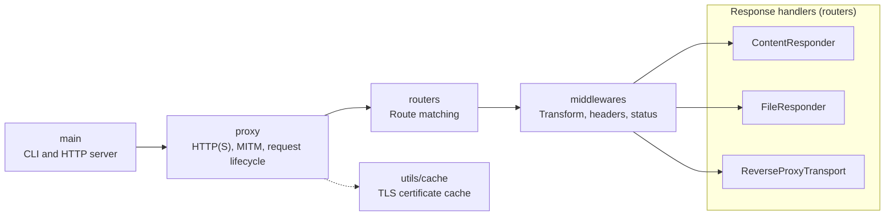

## Package Architecture

The main request path runs from the proxy through route matching and middleware to one of the response handlers.

When making changes:

- Update `models` and `models/config-spec.json` for configuration schema changes.
- Update `routers` for route matching or Content, File, and Rewrite behavior.
- Update `middlewares` for response transformations and common response overrides.
- Update `proxy` for HTTP proxying, HTTPS interception, certificates, and request lifecycle behavior.
- Add end-to-end coverage under `integration_test`.
