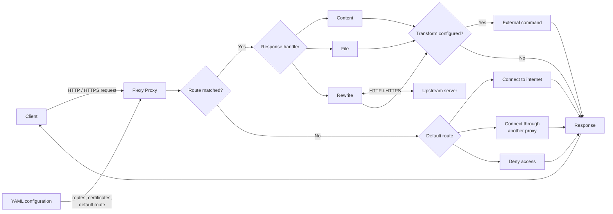

# Flexy Proxy

An easy-to-start, YAML-based flexible proxy server for software development. Return customized responses for specific URLs.

## Features

- **Customizable Responses**: Set responses for specific URLs using one of the following methods:
  - **File**: Return any file stored on the storage.
  - **Rewrite**: Rewrite the URL to another URL like a reverse proxy.
  - **Content**: Directly return a string content as the response.
  - **Transform**: Apply a transformation command to the response content.
- **Regex Based Matching**:
  - Use regex to route URLs.
  - Dynamically change the reverse proxy destination using variables.
- **Default Route Configuration**: Choose the behavior when no routing matches.
  - Connect to the internet.
  - Connect to another proxy.
  - Deny access.

**Request Flow**



## Installation

### Binary Download

You can download the binary files from the [GitHub Releases](https://github.com/kajikentaro/flexy-proxy/releases) page. Choose the version that suits your operating system and architecture.

### Install from Commands

After executing appropriate commands for your system, you can run Flexy Proxy by typing `flexy`. For example, if you want to check the version, just type `flexy version`.

#### macOS (both intel and Apple silicon)

```
export LATEST_TAG=$(curl -s https://api.github.com/repos/kajikentaro/flexy-proxy/releases/latest | grep "tag_name" | sed -E 's/.*"tag_name": "(.*)".*/\1/')
export ARCH=$(uname -m)
curl -L "https://github.com/kajikentaro/flexy-proxy/releases/download/$LATEST_TAG/flexy-$LATEST_TAG-darwin-$ARCH" -o ./flexy
chmod +x ./flexy
sudo mv ./flexy /usr/local/bin/flexy
```

#### Linux (x86-64)

```
export LATEST_TAG=$(curl -s https://api.github.com/repos/kajikentaro/flexy-proxy/releases/latest | grep "tag_name" | sed -E 's/.*"tag_name": "(.*)".*/\1/')
curl -L "https://github.com/kajikentaro/flexy-proxy/releases/download/$LATEST_TAG/flexy-$LATEST_TAG-linux-amd64" -o ./flexy
chmod +x ./flexy
sudo mv ./flexy /usr/local/bin/flexy
```

#### Linux (arm64)

```
export LATEST_TAG=$(curl -s https://api.github.com/repos/kajikentaro/flexy-proxy/releases/latest | grep "tag_name" | sed -E 's/.*"tag_name": "(.*)".*/\1/')
curl -L "https://github.com/kajikentaro/flexy-proxy/releases/download/$LATEST_TAG/flexy-$LATEST_TAG-linux-arm64" -o ./flexy
chmod +x ./flexy
sudo mv ./flexy /usr/local/bin/flexy
```

### Build from Source with Go

If you prefer to build from source, you can install Flexy Proxy using `go install`.

```
go install github.com/kajikentaro/flexy-proxy@latest
```

## Usage

1. Prepare the executable and add it to your PATH  
   Make sure the `flexy` binary is either in your system's PATH or moved to a location like `/usr/local/bin`.

2. Create a `config.yaml` file  
   Define your routes and responses in a `config.yaml` file. For example:

   ```yaml
   routes:
     - url: "http://sample.test"
       regex: false
       response:
         content: "hello world\n"
   ```

3. Run the proxy with your config file  
   Execute `flexy` with the `-f` flag pointing to your configuration file:

   ```bash
   flexy -f config.yaml
   ```

4. Use the proxy  
   Now, you can use the proxy with a tool like `curl`:

   ```bash
   $ curl http://sample.test -x http://localhost:8888
   hello world
   ```

## Configurations

For more details on configurations, visit:
[https://kajikentaro.github.io/flexy-proxy/output/](https://kajikentaro.github.io/flexy-proxy/output/)

### Example

For an example configuration, please refer to [examples/basic/config.yaml](examples/basic/config.yaml) in the repository.

```
routes:
  # If the request URL is "https://www.google.com", show content from "https://example.com" instead.
  - url: "https://www.google.com"
    response:
      rewrite:
        to: "https://example.com"
```

## Certificates

The following commands create a private key (`server.key`) and a certificate (`server.csr`). By specifying options, Flexy Proxy can use this private key and certificate to generate new certificates for the requested hostname and use them for communication. By installing the `server.crt` certificate on your PC or browser, responses from Flexy Proxy will be considered secure.

```
openssl genrsa -out server.key
openssl req -x509 -new -nodes -key server.key -sha256 -days 3650 -out server.pem -subj "/C=JP/ST=Tokyo/L=Minato/O=Example Company/OU=IT Department/CN=example.com"
openssl x509 -outform der -in server.pem -out server.crt
```

Specify the certificates in the YAML file as follows:

```yaml
certificate: "server.pem"
certificate_key: "server.key"
```
